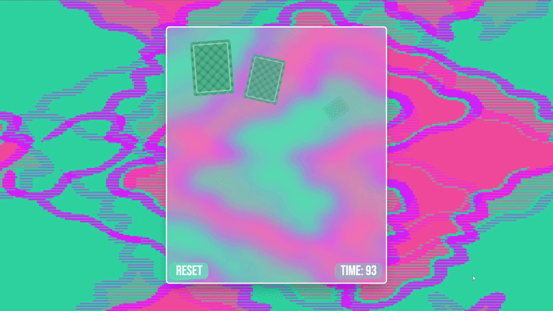

# Super Paria NG



Jugo de encontrar las parejas tipo arcade. Juega contrarreloj y gana puntos en función del tiempo restante y los combos obtenidos por encontrar parejas de forma consecutiva.

## 🎮 Características

- **Juego de Memoria**: Encuentra parejas de cartas en una cuadrícula de 4x4
- **Sistema de Combos**: Acumula puntuaciones bonus por encontrar parejas consecutivas
- **Temporizador**: 90 segundos para completar el reto
- **Efectos Visuales**: Animaciones de las cartas, destellos y vibraciones al encontrar parejas, fondos dinámicos
- **Audio**: Música de fondo, efectos de sonido y audio de combos
- **Puntuación Animada**: Animación fluida del score del tiempo y cada combo
- **Diseño Responsivo**: Interfaz moderna con Tailwind CSS
- **Cartas generadas automáticamente**: Los dibujos de cada carta se generan, solo hay imágenes de cada palo y figura.

## 🚀 Instalación y Desarrollo

### Requerimientos
- Node.js 18+
- Angular 21

### Clonar e instalar

```bash
git clone <repositorio>
cd super-paria-ng
npm install
```

### Servidor de desarrollo

```bash
npm start
```

Accede a `http://localhost:4200/` en tu navegador. La aplicación se recargará automáticamente con los cambios.

## 🏗️ Estructura del Proyecto

```
src/app/
├── app.ts                 # Componente raíz
├── app.config.ts          # Configuración de Angular
├── game/                  # Lógica principal del juego
│   ├── card/              # Componente individual de carta
│   ├── game-controller/   # Controlador del flujo de juego
│   ├── score-component/   # Pantalla de puntuación final
│   ├── combo-component/   # Sistema de combos
│   └── interfaces/        # Tipos de datos (Combo, Deck)
└── shared/                # Servicios compartidos
    ├── sound-service.ts   # Gestión de audio
    ├── button-component/  # Botón reutilizable
    └── earthbound-background/  # Fondo animado con tema Earthbound
```

## 📊 Cómo Jugar

1. Se revelan las carta de juego durante un tiempo
2. Las cartas se voltearán después de ese tiempo
3. Haz clic en cartas para encontrar parejas
4. Cada pareja correcta suma 1 combo al encontrar parejas consecutivamente
5. Al terminar, se calcula: `(Tiempo Restante × 1000) + (Suma de puntuación de cada combo)`
6. El score se anima gradualmente hacia el total

## 🧪 Testing

Ejecuta las pruebas con:

```bash
npm test
```

Los tests usan Vitest y están ubicados en archivos `.spec.ts` junto a cada componente.

## 🔨 Build

Para producción:

```bash
npm run build
```

Los artefactos de build se guardan en `dist/`.

## 🛠️ Tecnologías

- **Angular 21** - Framework principal
- **TypeScript** - Lenguaje de programación
- **Tailwind CSS** - Estilos y diseño
- **Signals** - Gestión de estado reactivo
- **Vitest** - Testing

## 📝 Convenciones

- Componentes standalone
- Signals para estado local
- Control de flujo nativo (`@if`, `@for`)
- Cambio de detección OnPush
- Inputs/Outputs como funciones

## 🎨 Créditos

Inspirado en el estilo visual de Earthbound/Mother series.

```bash
ng e2e
```

Angular CLI does not come with an end-to-end testing framework by default. You can choose one that suits your needs.

## Additional Resources

For more information on using the Angular CLI, including detailed command references, visit the [Angular CLI Overview and Command Reference](https://angular.dev/tools/cli) page.
